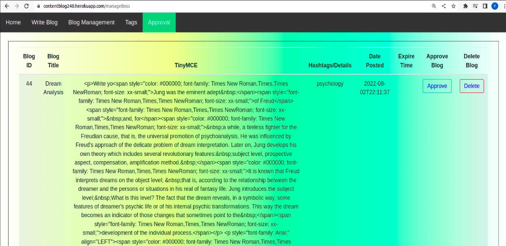
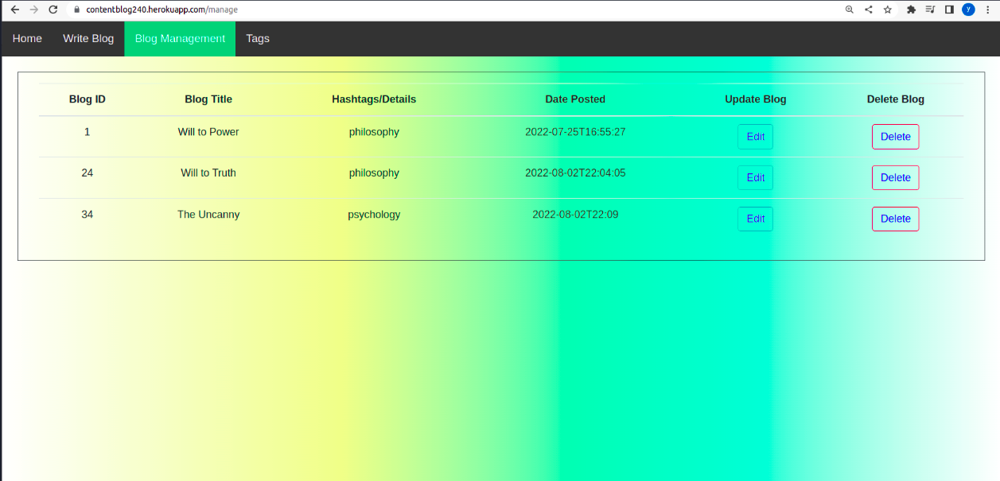
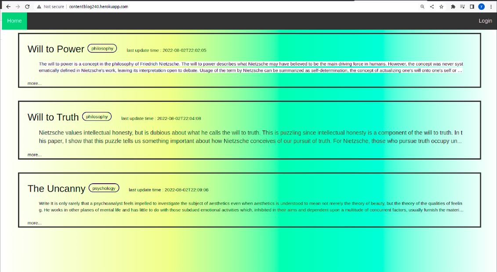

# C240 Capstone Team Design Project  Wiley-Edge 

# [Website](https://contentblog240.herokuapp.com/)
  

# Supervisor/Instructor : 

                Shams Al Ajrawi

# Team members :

                Zhicong Zhou

                Jingyang Jiang

                Yida Li

# Specification : 

                Full stack CRUD web-application that allows the client to write, manage, and display his blogs online.

# Client Requirements:

                Clients must be able to display their blog posts to everyone who comes to their web-site. 

                Clients must be able to create and insert tags related to their blogs.

                Clients wants to write their posts in an embedded online editor like Word.

                Admins are able to manage tags and edit/write blogs.

                Clients are given exclusive rights to approve the edited blogs by the admins. 

                Users are only able to view the content of the blog or access admin role through login.

# Technologies :

                IDE : Intellij, Netbeans, Visual code studio

                Framework : Java Spring Framework

                Database: Mysql

                Cloud: ClearDB

                Deployment : Heroku

                SDLC : Extreme Programming
        

# Client View :

# Editor View :

# User View  :

